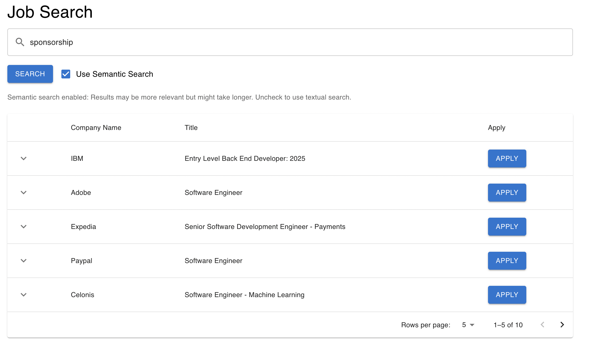

# Semantic Job Search

Semantic Job Search is an application designed to enhance the job search experience. 
This app enables users to search for jobs by filters like **entry-level**, **mid-level**, or exclude jobs requiring **security clearance**, making job hunting intuitive and tailored to individual preferences.

## Features

- **Semantic Search**: Fetches jobs based on a more natural and flexible search query using Elasticsearch.
- **Job Filtering**: Search for jobs by level (entry-level, mid-level) and exclude specific types (e.g., requiring security clearance).
- **Fast and Reliable**: Backend powered by Elasticsearch for fast and efficient job search.
- **User-Friendly Interface**: Modern UI for seamless job browsing.

---

## Prerequisites

1. **Python** (v3.8+)
2. **Elasticsearch** account credentials
3. **Elastic Cloud ID** and **API Key**
4. **React** and **Material-UI**

---

## Setup and Installation

### Backend Setup

1. **Clone the repository**:
   ```bash
   git clone https://github.com/tarunsunny3/semantic-job-search.git
   cd semantic-job-search/backend
   ```

2. **Install Python dependencies**:
   Make sure you have `pip` installed.
   ```bash
   pip install -r requirements.txt
   ```

3. **Configure Environment Variables**:
   Create a `.env` file in the `backend` folder and add the following keys:
   ```plaintext
   ELASTIC_CLOUD_ID=your_elastic_cloud_id
   ELASTIC_API_KEY=your_elastic_api_key
   ```

   Replace `your_elastic_cloud_id` and `your_elastic_api_key` with your actual Elasticsearch credentials.

4. **Run the backend server**:
   ```bash
   python app.py
   ```
   The backend will be available at `http://localhost:5001`.

### Frontend Setup

1. **Navigate to the frontend folder**:
   ```bash
   cd ../frontend
   ```

2. **Install Node.js dependencies**:
   ```bash
   npm install
   ```

3. **Run the frontend app**:
   ```bash
   npm start
   ```
   The frontend will be available at `http://localhost:3000`.

---

## Usage

- Open the frontend URL `http://localhost:3000` in your browser.
- Use the search bar to input job queries. Toggle semantic search to switch between flexible search and traditional search.
- Filter jobs based on your preferences like job levels and exclude jobs with certain criteria (e.g., requiring security clearance).

---

## Project Structure

```
semantic-job-search/
├── backend/
│   ├── app.py                 # Flask server entry point
│   ├── elastic_client.py      # Elasticsearch singleton client
│   ├── requirements.txt       # Python dependencies
│   └── .env                   # Environment variables (not included in repo)
├── frontend/
│   ├── src/
│   │   ├── components/        # React components
│   │   ├── App.tsx            # Main frontend app
│   │   ├── api/               # API integration for backend
│   ├── package.json           # Node.js dependencies
│   └── public/                # Static files
└── README.md
```

---

## Screenshots



---

## Contributions

Contributions are welcome! Please follow these steps:

1. Fork the repository.
2. Create a new branch for your feature: `git checkout -b feature-name`.
3. Commit your changes: `git commit -m "Add feature"`.
4. Push to the branch: `git push origin feature-name`.
5. Create a pull request.

---

## License

This project is licensed under the MIT License.

---

## Contact

For questions, feel free to reach out via the repository [Issues](https://github.com/tarunsunny3/semantic-job-search/issues) page.

---

**Happy Job Hunting!**
